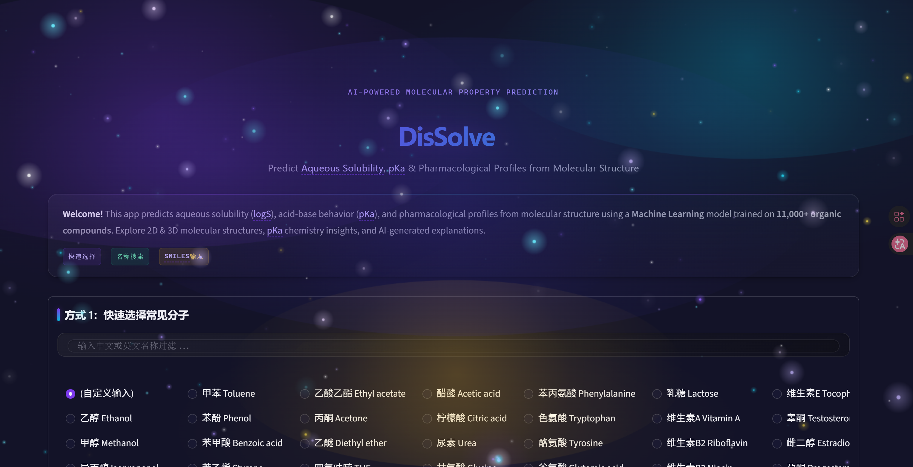
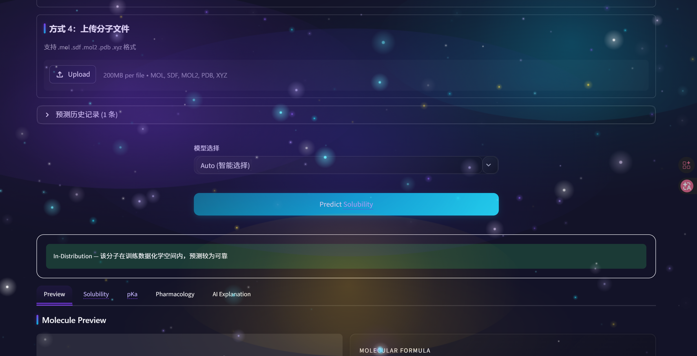
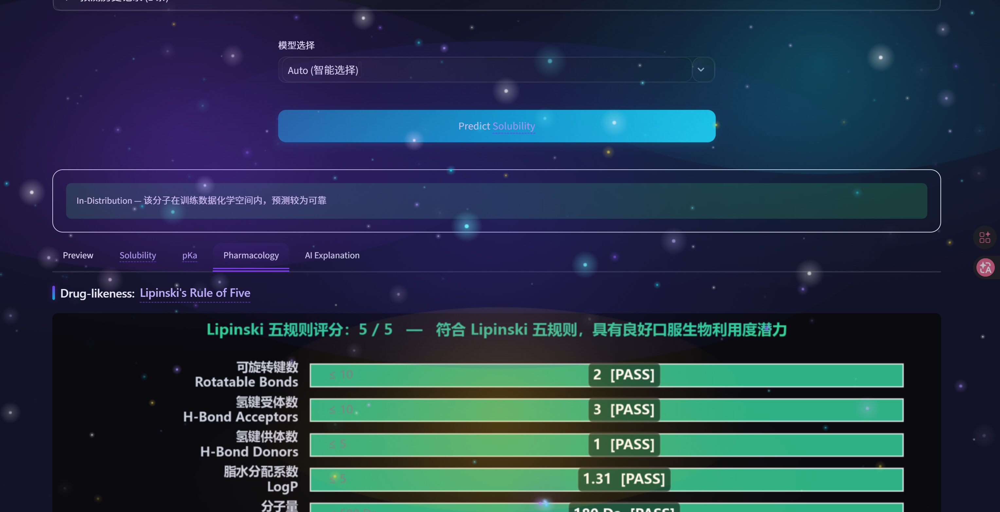

#  Molecular Solubility Predictor

Predict aqueous solubility (logS) of organic molecules using Machine Learning.

[](https://github.com/Leonlee114514/molecular-solubility-predictor/actions/workflows/test.yml)

##  Overview

This web application predicts how well a molecule dissolves in water (**logS**) from its molecular structure (SMILES string). It combines:

- **RDKit** for cheminformatics and molecular feature extraction
- **Random Forest** (clean V6) + **GNN** (clean V5) trained on **14,000+ organic compounds**
- **Separate acidic/basic pKa models** trained on 410,000+ pKa measurements
- **PubChem API** for real-time molecule lookup
- **Kimi AI (Moonshot)** for chemistry explanations in plain Chinese

Built as a high school chemistry + machine learning project.

##  Architecture

A React frontend over a FastAPI backend, both sitting on one framework-free prediction service:

```
React (frontend/)  --HTTP/JSON-->  FastAPI (backend/)  -->  services/prediction.py
                                                                    |
                                                    model artifacts (core/artifacts.py)
                                                    chemistry constants (core/chemistry.py)
```

`services/prediction.py` decides *what a value means*; `frontend/` decides *how it looks*.
See [`docs/new-ui.md`](docs/new-ui.md) for the API summary and run steps.

> The Streamlit UI that originally fronted this project was retired in favour of the React port.
> It lived in `app.py`, `ui/`, `assets/` and `.streamlit/` and is recoverable from git history.

##  Screenshots

| Input & Search | Solubility Prediction | Pharmacology Analysis |
|:---:|:---:|:---:|
|  |  |  |

##  Tech Stack

| Layer | Technology |
|-------|------------|
| Frontend | React 19 + TypeScript + Vite + Tailwind (shadcn/ui) |
| Backend | FastAPI (uvicorn) |
| ML Model | Scikit-learn (Random Forest) + PyTorch GIN |
| Cheminformatics | RDKit |
| Fingerprint | Morgan (ECFP4, 1024-bit) |
| Descriptors | MolWt, LogP, TPSA, H-bonds, Rotatable Bonds, Rings |
| AI Explanation | Kimi API (OpenAI-compatible) |
| pKa | Two Random Forest regressors (acidic pKa + basic pKa) |
| External Data | PubChem PUG REST API |

##  Project Structure

```
.
├── pka_resolve.py              # Structural + numeric pKa pair resolution
├── features.py                 # Molecular feature computation
├── molecules.py                # Local DB + PubChem search
├── gnn_model.py                # Graph Neural Network (GIN)
├── gnn_explainer.py            # GNNExplainer (bond / feature attribution)
├── ood_detector.py             # Out-of-Distribution detection
│
├── services/                   # Framework-free prediction service
│   └── prediction.py           # Single prediction entry point
├── backend/                    # FastAPI app backing the React UI
│   ├── main.py
│   ├── routes.py               # /api endpoints
│   └── tasks.py                # In-memory batch task registry
├── core/                       # Business logic + shared constants
│   ├── analysis.py             # pKa, Lipinski, ADME/Tox
│   ├── ai_client.py            # Kimi AI explanation client
│   ├── artifacts.py            # Model/data artifact registry (single source)
│   ├── chemistry.py            # pKa band + strength thresholds (single source)
│   └── i18n.py                 # zh/en strings (server-side translation)
├── ui/
│   └── plots.py                # 2D structure rendering (theme-aware PNG)
├── frontend/                   # React 19 + Vite UI (see docs/new-ui.md)
│
├── tests/                      # Unit tests (pytest)
│   ├── test_features.py / test_analysis.py / test_molecules.py
│   ├── test_ood_detector.py / test_pka_resolve.py / test_chemistry.py
│   └── test_prediction_service.py / test_backend_api.py
│
├── scripts/                    # Training + evaluation scripts
├── output_v2/                  # Trained models + evaluation report
│   ├── solubility_model_v6_clean.pkl.gz  # clean RF
│   ├── gnn_solubility_model_v5_clean.pt  # clean GNN
│   ├── pka_acidic_model.pkl / pka_basic_model.pkl
│   └── evaluation_report.json
├── data/                       # Training datasets (CSV)
├── docs/                       # Screenshots + docs/new-ui.md
├── .env                        # API keys (not tracked)
├── requirements.txt            # runtime dependencies
├── requirements-dev.txt        # runtime + pytest + flake8
├── .gitignore
└── README.md
```

##  Quick Start

### 1. Clone the repository

```bash
git clone https://github.com/Leonlee114514/molecular-solubility-predictor.git
cd molecular-solubility-predictor
```

### 2. Create a virtual environment

```bash
# Using venv
python -m venv venv

# Windows
venv\Scripts\activate

# macOS/Linux
source venv/bin/activate
```

### 3. Install dependencies

> **Note:** RDKit is easiest to install via **conda**. If you use pip, make sure you have the required system libraries.

```bash
# Option A: Conda (recommended for RDKit)
conda install -c conda-forge rdkit
pip install -r requirements.txt

# Option B: Pure pip (if RDKit wheel is available for your platform)
pip install -r requirements.txt
```

### 4. Configure API keys

Create a `.env` file in the project root:

```env
KIMI_API_KEY=sk-your-moonshot-api-key-here
```

> You can get a free API key from [Moonshot AI](https://platform.moonshot.cn/).
> The app works without it, but the AI explanation feature will be disabled.

### 5. Prepare model files

If you don't have the trained model yet, run the training script (requires dataset):

```bash
python scripts/train_model_v2.py
```

Or use the pre-trained models already tracked in `output_v2/`.

### 6. Run it

Two processes: the API and the UI.

```bash
# terminal 1 — FastAPI backend on :8000
venv/Scripts/python.exe -m uvicorn backend.main:app --port 8000

# terminal 2 — React dev server on :3000 (proxies /api to :8000)
cd frontend
npm install
npm run dev
```

The UI opens at `http://localhost:3000`. If port 8000 is already taken, start the backend
elsewhere and point the proxy at it:

```bash
# bash
VITE_API_TARGET=http://localhost:8010 npm run dev
# Windows PowerShell
$env:VITE_API_TARGET='http://localhost:8010'; npm run dev
```

##  How It Works

### Input Methods

1. **Dropdown Menu** — 100+ built-in molecules (drugs, vitamins, hormones, pollutants, etc.)
2. **Name Search** — Three-tier search: local exact match → local fuzzy match → PubChem API
3. **Direct SMILES** — Paste any valid SMILES string

### Feature Engineering

For each molecule, RDKit extracts 13 molecular descriptors + a 1024-bit Morgan fingerprint:

| Feature | Description |
|---------|-------------|
| MolWt | Molecular weight (g/mol) |
| LogP | Lipophilicity (octanol/water partition) |
| TPSA | Topological Polar Surface Area (Ų) |
| NumHDonors | Hydrogen bond donors |
| NumHAcceptors | Hydrogen bond acceptors |
| NumRotatableBonds | Molecular flexibility |
| NumAromaticRings | Aromatic ring count |
| NumAliphaticRings | Aliphatic ring count |
| FractionCSP3 | Fraction of sp³ carbons |
| NumSaturatedRings | Saturated ring count |
| HallKierAlpha | Molecular flexibility (Hall–Kier α) |
| Chi0v / Chi1v | Valence connectivity indices (order 0 / 1) |
| Morgan FP | 1024-bit circular fingerprint (ECFP4) |

### Prediction Interpretation

| logS Range | Solubility | Example |
|------------|------------|---------|
| > 0 | Highly soluble | Ethanol |
| -2 ~ 0 | Moderately soluble | Many drug molecules |
| < -2 | Poorly soluble | Hydrophobic compounds |

##  AI Explanation

The app optionally calls **Kimi (Moonshot AI)** to generate a student-friendly explanation:
- Solubility conclusion
- Structural reasoning (polarity, hydrogen bonding, hydrophobicity)
- Real-life analogy

This is triggered manually to respect API rate limits and costs.

##  Model Training

The training pipeline (`train_model_v2.py`) typically includes:

1. Load solubility dataset (e.g., ESOL, AqSolDB, or custom curated data)
2. SMILES → RDKit molecular features + Morgan fingerprints
3. Train/test split
4. Random Forest regression with hyperparameter tuning
5. Save model + descriptor names for inference

> **Note:** Training scripts live under `scripts/`. Large raw CSV datasets are git-ignored; the pre-trained model artifacts are committed in `output_v2/`.

##  Model Evaluation

Reproduce the hold-out evaluation (a new stratified split that is *not* the
training split, retraining the RF for a clean test metric):

```bash
python scripts/evaluate_models.py
```

This writes `output_v2/evaluation_report.json` with per-source R²/RMSE/MAE and
compares RF, GNN, and ensemble strategies. A `--quick` smoke mode is available.

Clean production models are trained with the same seed=2026 outer test split:

```bash
python scripts/train_rf_v6_clean.py     # clean RF
python scripts/train_gnn_clean.py       # clean GNN
```

Clean hold-out results (R²): RF 0.797, GNN 0.801, 0.5/0.5 ensemble 0.835.
The Auto mode uses the 0.5/0.5 ensemble and shows OOD/disagreement warnings
without routing to a single model.

pKa models are evaluated during training by `scripts/train_pka_models_v2.py`,
which writes `output_v2/pka_models_config.json`.

##  Deployment

Two pieces to host: the FastAPI backend (`uvicorn backend.main:app`) and the built frontend
(`cd frontend && npm run build`, then serve `frontend/dist/`).

### Notes

- **API key**: `KIMI_API_KEY` must be in the environment (`.env` locally). Without it the
  AI-explanation endpoint returns 503; everything else keeps working.
- **Model files**: the RF / pKa / GNN artifacts under `output_v2/` are tracked with Git LFS
  (~90 MB, plus ~78 MB per pKa model). Run `git lfs install` before cloning, or fetch them separately.
- **Same-origin**: the frontend calls `/api/...` on its own origin, so a deployment needs either
  a reverse proxy to the backend or `VITE_API_TARGET` set at build time.
- **PubChem API**: the app includes rate limiting (1.2s delay) and SSL workarounds for Chinese networks.

##  Contributing

This is a personal learning project, but suggestions and issues are welcome!

##  License

[MIT License](LICENSE)

##  Acknowledgments

- [RDKit](https://www.rdkit.org/) — Cheminformatics toolkit
- [PubChem](https://pubchem.ncbi.nlm.nih.gov/) — Chemical database
- [Streamlit](https://streamlit.io/) — Web app framework
- [Moonshot AI](https://www.moonshot.cn/) — Kimi large language model
- [ESOL Dataset](https://pubs.acs.org/doi/10.1021/ci034243x) — Solubility data (Delaney, 2004)

---

Built by Leonlee
